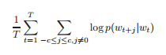
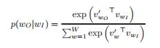
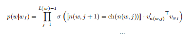
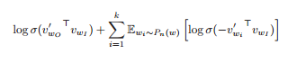

# Distributed Representations of Words and Phrases and their Compositionality
Tomas Mikolov,
Ilya Sutskever,
Kai Chen,
Greg Corrado,
Jeffrey Dean

## Introduction
Vector representations allow Natural Language Processing algorithms to perform better on tasks by grouping similar words.
Such vector representations are analogous to the ones learnt from images using autoencoder networks.
This paper deals with learning high-quality vector representations of text data. The skip gram model is a way to do the same. The authors propose several extensions to improve both the quality of representations and training speed of the skip gram model.

They also propose a method to find phrases in text.


## Skip gram model
Given a sequence of training words `w_1, w_2, ...., w_T`, 
minimize the average log probability : 



where c is the context size, `w_T` the center word. 
The basic naive Skip gram formulation defines `p(w_{t+j} | w_t)` using the softmax function as :



where `v_w` and `v'_w` are the input and output vector representation of word `w` and `W` is the number of words in the vocabulary. This is impractical as the cost of finding the derivative of `log p(w_O | w_I)` is proportional to the size of vocabulary which is as large as 10^5 - 10^7 terms.

The authors discuss some ways to tackle this problem.

## Heirarchial softmax
This method was proposed by Morin and Bengio et al. to reduce the compuational complexity of learning vector representations.
The key idea is - instead of evaluating all `W` output nodes, evaluate only `log_2(W)` nodes to obtain the corresponding probability distribution.



```
n(w,j) : jth node on path from root to w.
L(w) : length of path from root to w.
ch(n) : arbitrary fixed child of n.
[[x]] : 1 if x is true else -1.
σ(x) = 1/(1 + exp(-x))
```

The structure of the tree used has a considerable effect on performance. The authors used a binary huffman tree. Grouping words by frequency speeds up the model.

## Negative sampling
This method is a modification of Noise contrast estimation (NCE) which was proposed by Gutmann and Hyvarunen as an altenative to the Heirarchial softmax. Since the aim is to learn high quality vector representations, the authors have simplified the objective to be :



This objective replaces every `log p(w_O|w_I)` in the skip gram objective. So, the task now is to identify the target word `w_O`
from `k` negative samples from the noise distribution. This appears similar conceptually to monte carlo integration.

## Subsampling frequent words
The authors also propose a heuristic subsampling approach to counter the fact that rare words tend to provide more information that frequent ones. The idea is to discard every word `w_i` with the probability
```
P(w_i) = 1 - sqrt(t / f(w_i))
```
where `f(w_i)` is the frequency of the word and t is chosen threshold.

## Learning Phrases
The same algorithms can be applied to learning vector representations of phrases.
The authors identified words that occur frequntly in some contexts and infrequnetly in others and then replaced them with unique tokens. This allowed them to form phrases without drastically affecting the size of the vocabulary.

## Compositionality
The word and phrase vectors learnt using skip gram models have additive compositionality. For instance, if "Volga River" appears frequently in the same sentence with words "Russian" and "river", then
```
vec("Russian") + vec("river") ~ vec("Volga River")
```


