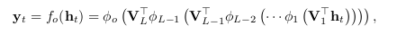
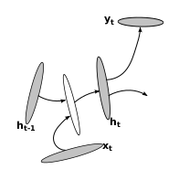
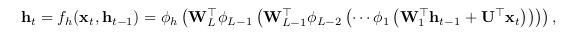
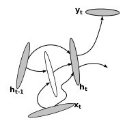
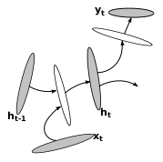
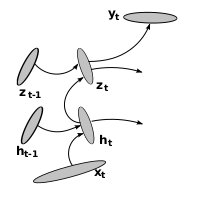
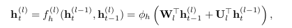

# How to Construct Deep Recurrent Neural Networks

Razvan Pascanu, Caglar Gulcehre, Kyunghyun Cho, Yoshua Bengio

## Introduction

Recurrent Neural Networks (RNNs) are a class of Neural Networks that have their output at each step fed back along with the next input. The authors argue that the depth of an RNN is not as straigh forward as that of a Feedforward Neural Network. 

RNNs can be unfolded through time and are in one sense infinitely deep. However, the network is still in some aspects shallow. The authors propose two architectures for deep RNNs.

## The RNN

Formally, an RNN can be defined as a system with input `x_t` at time `t` and output `y_t` and hidden state `h_t`. 

```
h_t = f_h( x_t, h_{t-1} ) ... (1)
y_t = f_o( h_t ) ... (2)
```

where `f_h` is a state transition function  parmeterized by parameters `theta_h` and `f_o` is an output function parameterized by parameters `theta_o`.

The objective of the RNN is to minimize the divergence `d` between the actual output and predicted output. (For ex. `d` = cross entropy)

Conventionally `h_t` and `y_t` are defined as :

```
h_t = f_h( x_t, h_{t-1} ) = phi_h( W'*h_{t-1} + U'*x_t )
y_t = f_o( h_t, x_t ) = phi_o( V'*h_t )
```

W = transition matrix, U = input matrix, V = output matrix;

phi_h and phi_o are elementwise nonlinear functions.

## Why deep RNNs ?

- Deeper models are more powerful when it comes to representing certain functions.
- When unfolded, RNNs are very deep. But at a particular time-step, RNNs are quite shallow.
- hidden-to-hidden, hidden-to-output, input-to-hidden functions are shallow - no intermediate layers.

## Deep input-to-hidden RNNs

Previous works on feedforward Deep Neural Networks have shown that deep input-to-hidden functions allow the model to better exploit the non-temporal structure from input.  The authors propose that, similarly the deep input-to-hidden functions will make it easier to learn the temporal structure too.

This is similar to replacing input with extracted features - manually or otherwise (like PCA).

## Deep hidden-to-output RNNs (DO-RNN)

Deep hidden-to-output functions allow the hidden states to be more concise. This is because  output layer can interpret the hidden layers in a better way.



## Deep hidden-to-hidden RNNs (DT-RNN)

Here, the hidden layer is replaced with a number of layers such as a Multilayered Perceptron (MLP). A Deep Transition RNN (DT-RNN) can would look like :





However, with an increase in the number of hidden layers, it becomes computationally expensive to compute the gradient. This, in turn makes it difficult to train the network. Adding shortcut connections like a Residual Neural Network is a possible solution. Such an RNN is refered to as a DT(S)-RNN.



A combination of DT-RNN and DO-RNN i.e. an RNN with both deep hidden-to-output function and a deep transition is called a Deep Output, Deep Transition RNN (DOT-RNN).




## RNN with Stack of hidden layers

Another way to make an RNN deep is to stack multiple recurrent hidden layers on top of each other. Such a model is called a stacked RNN (sRNN).





 If we look at each recurrent level separately, we can still see that the connections between layers are still *shallow*. While this limits the family of functions it can represent, this property allows the RNN to model multiple time scales simultaneously. Modelling multiple time scales is hard with DT-RNNs.

## Neural Operators

The authors also discuss an operator based framework to building RNNs. They define the following operators :

- plus : `h' = x ⊕ h `; compute summary of x and h
- predict :  `x' = ▷ h`; predict most likely output given summary h

## Experimental Results

The authors compared the proposed deep RNNs with the regular RNN on the tasks of Music (Nottingham, JSB chorales, MuseData) and text - word and character level prediction (Penn Treebank Corpus).


- For polyphonic music prediction, in each case, at least one deep RNN outperformed the regular RNN.
- DT(S)-RNN is almost as good as regular RNN with fast dropout.
- For language modelling, all of the proposed deep RNNs clearly outperform the regular RNN in both char-level and word-level modelling.
- DOT(S)-RNN and sRNN surpassed the previous best performance (by Graves et al. 2013) on the word level text prediction task.