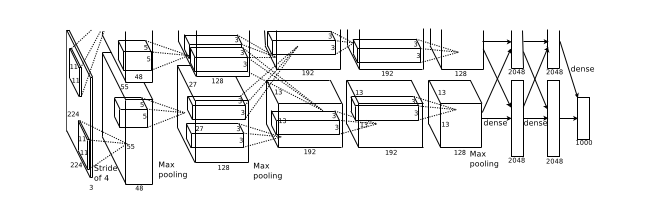

# ImageNet Classification with Deep Convolutional Neural Networks (2012)
Alex Krizhevsky,
Ilya Sutskever,
Geoffrey E. Hinton

The authors of this groundbreaking paper trained a Neural Network to classify images for the ImageNet LSVRC-2010 contest. They used Convolutional Neural Networks to almost halve the error rates for object recognition. The paper is a description of the dataset, their architecture and their results.

## The dataset
The ImageNet dataset consistss of 15 million labelled images spread across nearly 22,000 catgories.

ILSVRC used a subset of the same with 1,000 images in each of the 1,000 catgories.
Since the dataset contained variable high-resolution images, the authors cropped and downsamples the images to 256x256. They also normalized each pixel by subtracting the mean from the training data.

## The Architecture
The network conists of 8 learned layers - 5 Convolutional and 3 fully-connected. The output of the last fully connected layer is fed into a 1000-way softmax corresponding to each of the 1000 output classes. Max Pooling follows response normalization layers as well as the 5th Convolutional layer.

The authors chose a Rectified Linear Unit Nonlinearity over the more traditional sigmoid or hyperbolic tangent functions. This is becaus saturating (squashing output in a limited range) non-linearities such as sigmoid are much slower to train than non-saturating non-linearity such as ReLu.

The pooling layers summarize the outputs of neighbouring groups of neurons. Instead of having the traditional non-overlapping adjacent pooling layers, the authors chose to have a pooling scheme with overlapping layers. This reduces the top-1 and top-5 error rate by 0.4% and 0.3%.

Due to memory limitations on GPUs, the network had to be spread across 2 GPUs. This was possible as Curent GPUs are well suited to parallelization. Further, the design of the network was such that communication between GPUs was necessary only in certain layers.

## Reducing Overfitting

Since the architecture has 60 million parameters, overfitting was a major problem.

To reduce overfitting, the authors employed data augmentation. This method involves artificially enlarging the datset - transforming it without affecting the label. They performed  translations and horizontal reflections of the images. They also extracted 224x224 patches from the original 256x256 images resulting in an increase in training data by a factor of 2048.

Another approach to tackle overfitting was the dropout technique.

It involves randomly removing units from the hidden layers with a probability `p` for each training iteration. The dropped out neurons are not updated in backpropagation for that step.

In the testing phase, output of each of the hidden layer units is multiplied by `1-p` ie the probability of the unit surviving dropout. Doing so is a resonable approximation of model combination - training multiple models on different samples of data and then combining each model in some way.
The authors observed that dropout was effective in preventing overfitting in the network.

## Results and Discussion

|Model|Top-1|Top-5|
|-----|-----|-----|
|Sparse coding|47.1|28.2|
|SIFT + FVs|45.7|25.7|
|CNN|37.5|17.0|

Using CNNs in image Classification results in highly accurate Classification. Removal of a single Convolutional layer results in degradation in performance.
