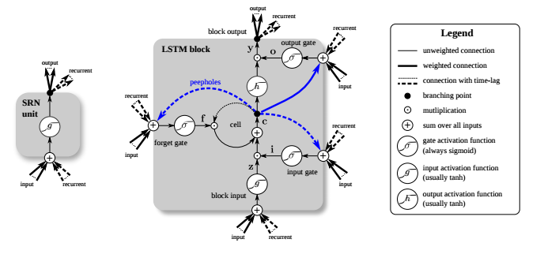
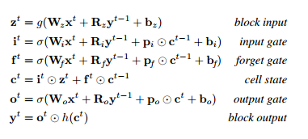

# LSTM: A Search Space Odyssey

Klaus Greff,
Rupesh Kumar Srivastava,
Jan Koutnik,
Bas R. Steunebrink,
Jurgen Schmidhuber 

## Introduction 
In this paper, the authors compare 8 Long Short Term Memory network variants on 3 representative tasks
- speech recognition
- handwriting recognition
- polyphonic music modelling

## The Vanilla LSTM

## The Variants

1. No input gate (NIG)
2. No forget gate (NFG)
3. No output gate (NOG)
4. No input activation function (NIAF)
5. No output activation function (NOAF)
6. No peepholes (NP)
7. Coupled input and forget gates (CIFG)
8. Full gate Recurrence (FGR)

## TIMIT
- speech corpus
- task: for each audio frame, classify as one of 16 phones.
- performance-metric: classification error %.

## IAM online
- handwriting database; english sentences.
- input features : (change in x, change in y, time since start of current stroke, is the pen lifted ?)
- task: map movements to characters
- performance-metric: character error rate

## JSB Chorales
- polyphonic music modelling dataset
- preprocessed sequences of binary vectors
- task: predict next in sequence.
- performance-metric: negative log likelihood

## Conclusion

- The vanilla LSTM performs reasonably well; none of the 8 modifications improve accuracy significantly
- Certain modifications can simplify the network without sacrificing a lot of performance. For instance, coupling i/p and forget gates or removing peephole connections.
- Learning rate and network size are the most crucial tunable hyperparameters.
- Learning rate and network size are independent and can be tuned separately. 

