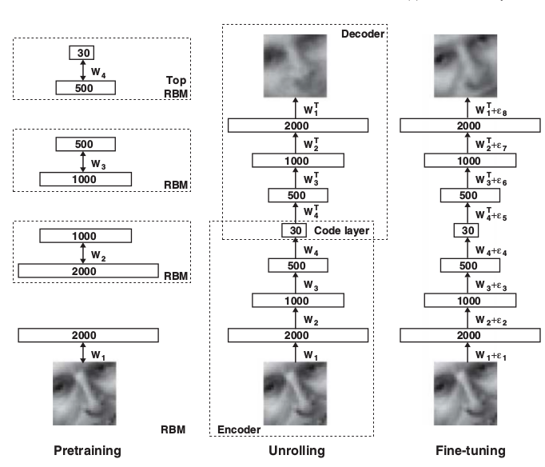

# Reducing the Dimensionality of Data with Neural Networks
G. E. Hinton, R. R. Salakhutdinov

This paper deals with the problem of dimensionality reduction. Deep Neural Networks having a small hidden layer can be used to find a more consise representation of high dimensional data. This is done by training the Network to re-construct the image - using the same image as input and expected output. Thus, the output at small hidden layer becomes the encoded form of the image.

The authors propose a method of initializing the weights of such autoencoder networks allowing them to work much better than PCA.

Images can be modelled using a 2 layer network known as Restricted Boltzmann Machine.
Pretraining consists of a stack of RBMs each with one layer of feature detector such that learned activations of one RBM is used as input data for training of next RBM.
After Pretraining, the RBMs are unrolled to create a deep autoencoder.