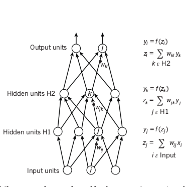
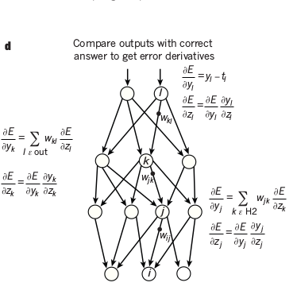
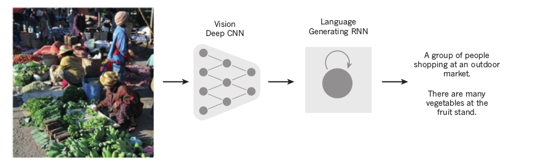
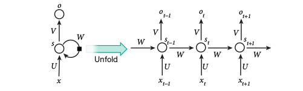

# Deep learning (2015)
Yann LeCun, Yoshua Bengio, Geoffrey Hinton

This paper summarises the breakthroughs brought about by deep learning
in the reconition and generation of image, video, speech and text.

The authors use examples to show how deep learning provides a 
feasible solution to these problems, which had seemed impossible to solve for years.

## Supervised learning

Machine Learning is the application of statistical methods to make predictions about the future using data about the past.
It works by finding patterns in data and using the same patterns to make predictions.

The most common form of machine learning is Supervised Learning. 
It consists of two phases - training and testing.

- In the training phase, a set of pre-labelled data is used to establish a mathematical relation between the data and labels.

- This mathematical relation, also called a model is used in the testing phase to predict labels for unlabelled data.

For example, consider the problem of classifying an image as a "Cat" or "Not a Cat".
In the training phase we would use a set of images which are labelled as 
either "Cat" or "Not a Cat" to build a model between the pixels of the image and whether it is a Cat or not.

In the testing phase, we would use the model on new unlabelled images to predict whether they contain Cats or not.

## Backpropagation to train multilayer architectures

Conventional Machine Learning does not work directly on raw data. 
Instead, we rely on engineers and domain experts to select and design features - 
values derived from the raw data that are strongly related to what we want to predict.

A feature can be thought of as an alternate representation of the data.

In the Cat example, the (Red, Green, Blue) color value of the center pixel could be used as a feature to determine 
if the picture is of a Cat.

Deep Neural Networks attempt tackle the problem of feature selection. These variants of Neural Networks, have many hidden layers that allow them to 
"learn" a better representation of the raw data. Thus, they can work directly with raw data eliminating the need for feature selection.
Given enough hidden layers Deep Neural Networks can model any function and are hence called Universal Approximators.

Deep Neural Networks can be trained by the same algorithm used to train neural networks - backpropagation.




Backpropagation consists of two passes over the network -
- Forward pass : it involves computing the output of each layer using the output of previous layer as input and thus, finding the output of the network by applying a non-linear function `f(z)` on the last layer.
- Backward pass : it involves comparing the output of the network with the actual value or the ground truth. This is propagated to each layer in the reverse order. Weights at each unit are updated 
using the derivative of the error term at that unit with respect to the output of that unit.

The non-linear functions used in neural networks include the rectified
linear unit (ReLU), commonly used in recent years
```
f(z) = max(0,z)
```

as well as the more conventional sigmoids, such as the hyberbolic tangent,
```
f(z) = (exp(z) − exp(−z))/(exp(z) + exp(−z))
```
and logistic sigmoid function,
```
f(z) = 1/(1 + exp(−z))
```

ReLu tends to learns faster in networks with many layers and hence is common in deep neural network architectures.

Training a Deep Neural Network with the normal Gradient Descent iterating over each training example one-by-one is slow and inefficient.
So, Deep Networks are trained using Stochastic Gradient Descent - 
a varation of the normal algorithm that involves randomly choosing examples a 
fixed number of examples and running backpropagation on them.

## Convolutional Neural networks

However, while designing features by hand works well for numerical data, it is very difficult and cumbersome to design features for images.
This is because the raw pixel data that we get from images may contain a lot of noise.

We need to make sure that our classification model is independent of color, shape, size, background and position of the Cat in the image while still
being sensitive to small changes. For example it should be a able to diffentiate between a Cat and a dog while still correctly classifying 
all kinds of cats as Cats.

Conventional Neural Networks attempt to solve this problem. They exploit the fact that in natural signals such as images, 
larger features are composed of many smaller ones. There are four key ideas
behind ConvNets are: local connections, shared weights, pooling and the use of
many layers.

A ConvNet consists of 3 kinds of layers -
- Convolution layer
- Pooling layer
- ReLu layer

### Convolution Layer
In a  Convolution Layer, units are arranged as feature maps. 
Each of the outputs of the previous layer is connected to patches in this feature map 
by a set of weights called a filter bank. All units in a layer share to same filter bank.

This allows detection of groups of patterns in images and makes their detection independent of location.
Output of each Convolution Layer is passed to a ReLu Layer.

### ReLu Layer
Rectified Linear Unit or ReLu layer adds non-linearity to the network. The function is fairly simple.
```
f(z) = max(0, z)
```
It sets all negative values to 0.

### Pooling Layer
The role of the pooling layer is to merge similar features into one. The key idea of a max-pooling operation is to split the image into uniform patches
and take the maximum value of each patch as representative of that patch.

Thus, CNNs are able to learn a better representation of the image and perform significantly better than simple Deep Neural Networks.

In the ImageNet competition in 2012, Deep CNNs were applied to a data set of about 
a million images from the web that spread across 1,000 different classes. The results were
nothing short of spectacular, almost halving the error rates of the best competing approaches.
This success has brought about a revolution in computer vision;
ConvNets are now the dominant approach for almost all recognition
and detection tasks, even approaching human performance on some tasks.

ConvNets have also been used in conjunction with Recurrent Neural Networks to generate text captions for images.


## Recurrent Neural networks

Recurrent Neural Networks have been used for a long time for tasks that involved sequential inputs, like text or speech.
In an RNN, the outputs of hidden units are fed back into them. This can be seen as different units in a deep multilayer network, considering each output in each time step to be from a difficult unit. This is called unfolding an RNN in time.


However, it is difficult to RNNs information for very long in their cells. Further, training is difficult as the gradients may typically vanish or explode.

To correct this, Long Short Term Memory (LSTM) Neural Networks where proposed. They augment the existing network with additional memory. LSTMs have been much more successful that traditional RNNs