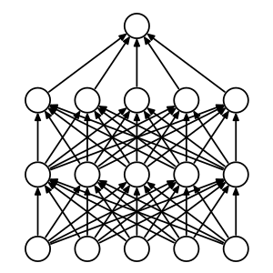
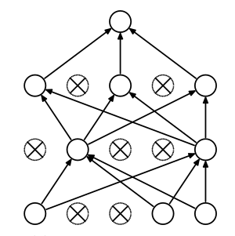

# Dropout: A Simple Way to Prevent Neural Networks from Overfitting

Nitish Srivastava,
Geoffrey Hinton,
Alex Krizhevsky,
Ilya Sutskever,
Ruslan Salakhutdinov


## Problem 
Deep neural networks overfit their training data. 
Hence, they have poor accuracy on testing data that was never seen during training. 

Conventional methods to solve this problem, also know as regularization include
 weight penalty based methods (L1 and L2) and averaging over multiple models.
They are slow and consume too much memory to be practical at a large scale.

Also, we may not always have enough data to build multiple models to average over.

## Key Idea
When training a neural network, randomly drop-out units. 
Dropping out a unit here, means temporarily hiding the unit along with its input and output connections 
( setting its output to 0 ).




When testing or making predictions, 
multiply the output of a dropped out unit by `p`, the probability of it being retained. 

## How does it work ?
Applying dropout to a network is equivalent to sampling a network with lesser number of units in each layer or "thinned" network. 
The thinned network has all the units that were survived dropout. 

So, a network of n units, is equivalent to a collection of 2^n thinner networks sharing weights.

However, when testing or making predictions, it is not feasible to average over an exponentially large number of networks. 
To tackle this, the authors suggest that a simple approximation method - 

Use the same network, but with no dropout, multiplying output of each dropout unit with the probability of it being retained.

```
w_predict = w_train * p
```

w_predict = weight being used for prediction.

w_train = weight learned from training.

p = probability of the unit being retained ( 1 - probability of dropout ).

## Footnotes
They also provide an intersting architecture of a CNN used on Street View House Numbers dataset in the appendix.
 

